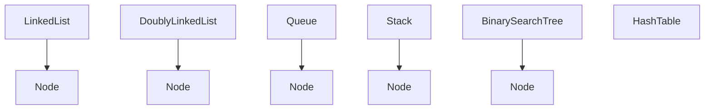

# Data Structures Library

A comprehensive Python implementation of fundamental data structures, including linked lists, queues, stacks, and trees.

## Implemented Data Structures

### Linked Lists
- **linkedlist.py** — Singly linked list implementation with standard operations
- **doublyLinkedList.py** — Doubly linked list supporting bidirectional traversal

### Queues
- **queue.py** — FIFO queue implementation

### Stacks
- **stack.py** — LIFO stack implementation

### Trees
- **tree.py** — Binary Search Tree (BST) with insert and search operations

### Hash Tables
- **hashTable.py** — Hash table implementation for efficient key-value storage

## Binary Search Tree (tree.py)

The Binary Search Tree implementation provides efficient insertion and search operations.

### Classes

#### Node
Represents a single node in the tree.

**Attributes:**
- `value` — The data stored in the node
- `left` — Reference to the left child node
- `right` — Reference to the right child node

#### BinarySearchTree
Manages the tree structure and operations.

**Methods:**
- `insert(value)` — Inserts a new value into the tree. Returns `True` if successful, `False` if the value already exists.
- `search(value)` — Searches for a value in the tree. Returns `True` if found, `False` otherwise.

### Example Usage

```python
my_tree = BinarySearchTree()
my_tree.insert(2)
my_tree.insert(1)
my_tree.insert(3)

print(my_tree.search(1))  # True
print(my_tree.search(5))  # False
```

## System Architecture

