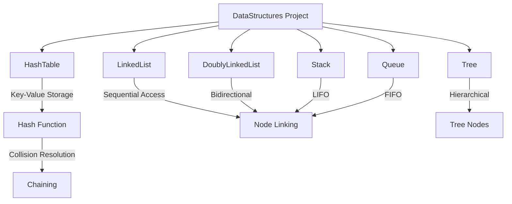

# DataStructures

A Python implementation of common data structures for educational purposes.

## Implemented Data Structures

### Linked List (`linkedlist.py`)

A singly linked list implementation with basic operations.

### Doubly Linked List (`doublyLinkedList.py`)

A doubly linked list implementation supporting traversal in both directions.

### Stack (`stack.py`)

A Last-In-First-Out (LIFO) stack implementation.

### Queue (`queue.py`)

A First-In-First-Out (FIFO) queue implementation with the following operations:
- **enqueue(value)**: Adds an element to the back of the queue
- **dequeue()**: Removes and returns the element from the front of the queue
- **print_queue()**: Prints all elements in the queue in order

## Usage

```python
from queue import Queue

# Create a queue and add elements
my_queue = Queue(1)
my_queue.enqueue(2)
my_queue.enqueue(3)

# Print queue contents
my_queue.print_queue()  # Output: 1 2 3

# Remove from queue
node = my_queue.dequeue()
print(node.value)  # Output: 1
```

## Project Structure

```
DataStructures/
├── hashTable.py
├── linkedlist.py
├── doublyLinkedList.py
├── stack.py
├── queue.py
├── tree.py
└── .idea/
```

## Data Structures Implemented

### 1. HashTable

- **File:** `hashTable.py`
- **Description:** A hash table implementation using chaining for collision resolution.
- **Methods:**
  - `set_item(key, value)` - Store a key-value pair in the hash table
  - `get_item(key)` - Retrieve a value by its key
  - `keys()` - Return a list of all keys in the hash table
  - `print_table()` - Print the internal structure of the hash table
- **Hash Function:** Uses a simple polynomial rolling hash with modulo operation
- **Collision Handling:** Chaining (storing multiple entries in a list at each index)

### 2. LinkedList

- **File:** `linkedlist.py`
- **Description:** Singly linked list implementation with standard operations

### 3. DoublyLinkedList

- **File:** `doublyLinkedList.py`
- **Description:** Doubly linked list allowing traversal in both directions

### 4. Stack

- **File:** `stack.py`
- **Description:** LIFO (Last In First Out) stack data structure

### 5. Queue

- **File:** `queue.py`
- **Description:** FIFO (First In First Out) queue data structure

### 6. Tree

- **File:** `tree.py`
- **Description:** Tree data structure implementation

## System Architecture



## Usage Example

### HashTable

```python
from hashTable import HashTable

# Create a hash table
my_hash_table = HashTable()

# Store key-value pairs
my_hash_table.set_item('bolts', 1400)
my_hash_table.set_item('washers', 50)
my_hash_table.set_item('lumber', 70)

# Retrieve a value
print(my_hash_table.get_item('washers'))  # Output: 50

# Get all keys
print(my_hash_table.keys())  # Output: ['bolts', 'washers', 'lumber']

# View internal structure
my_hash_table.print_table()
```
