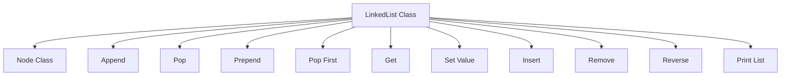

# DataStructures

A comprehensive Python library implementing fundamental data structures and algorithms. This project provides efficient, well-tested implementations of common data structures used in computer science.

## Implemented Data Structures

### Linked List (`linkedlist.py`)

A singly linked list implementation with basic operations.

### Doubly Linked List (`doublyLinkedList.py`)

A doubly linked list implementation supporting traversal in both directions.

### Stack (`stack.py`)

A Last-In-First-Out (LIFO) stack implementation.

### Queue (`queue.py`)

A First-In-First-Out (FIFO) queue implementation with the following operations:
- **enqueue(value)**: Adds an element to the back of the queue
- **dequeue()**: Removes and returns the element from the front of the queue
- **print_queue()**: Prints all elements in the queue in order

## Usage

```python
from linkedlist import LinkedList

# Create a new linked list
ll = LinkedList(5)

# Add elements
ll.append(10)
ll.append(15)
ll.prepend(3)

# Print the list
ll.print_list()  # Output: 3, 5, 10, 15

# Access and modify
node = ll.get(1)
ll.set_value(1, 7)

# Remove elements
ll.pop()      # Remove last element
ll.pop_first()  # Remove first element

# Reverse
ll.reverse()
```

## Project Structure

- `linkedlist.py` - Singly linked list implementation
- Additional data structures (queue, stack, tree, hash table) coming soon

## Data Structures Implemented

### 1. HashTable

- **File:** `hashTable.py`
- **Description:** A hash table implementation using chaining for collision resolution.
- **Methods:**
  - `set_item(key, value)` - Store a key-value pair in the hash table
  - `get_item(key)` - Retrieve a value by its key
  - `keys()` - Return a list of all keys in the hash table
  - `print_table()` - Print the internal structure of the hash table
- **Hash Function:** Uses a simple polynomial rolling hash with modulo operation
- **Collision Handling:** Chaining (storing multiple entries in a list at each index)

### 2. LinkedList

- **File:** `linkedlist.py`
- **Description:** Singly linked list implementation with standard operations

### 3. DoublyLinkedList

- **File:** `doublyLinkedList.py`
- **Description:** Doubly linked list allowing traversal in both directions

### 4. Stack

- **File:** `stack.py`
- **Description:** LIFO (Last In First Out) stack data structure

### 5. Queue

- **File:** `queue.py`
- **Description:** FIFO (First In First Out) queue data structure

### 6. Tree

- **File:** `tree.py`
- **Description:** Tree data structure implementation

## System Architecture



## Usage Example

### HashTable

```python
from hashTable import HashTable

# Create a hash table
my_hash_table = HashTable()

# Store key-value pairs
my_hash_table.set_item('bolts', 1400)
my_hash_table.set_item('washers', 50)
my_hash_table.set_item('lumber', 70)

# Retrieve a value
print(my_hash_table.get_item('washers'))  # Output: 50

# Get all keys
print(my_hash_table.keys())  # Output: ['bolts', 'washers', 'lumber']

# View internal structure
my_hash_table.print_table()
```

# Project Repository

This is a new repository initialized with an empty first commit.

## Getting Started

This repository has been set up as a blank slate for development. Follow the sections below to begin working with this project.

## Prerequisites

- Ensure you have the necessary development tools installed for your intended project type.
- Review the project requirements before starting development.

## Installation

1. Clone the repository to your local machine:
   ```bash
   git clone <repository-url>
   cd <repository-name>
   ```

2. Initialize the project structure according to your needs.

3. Install any required dependencies based on your tech stack.

## Contributing

Follow standard Git workflows when contributing to this project. Create feature branches, make atomic commits, and submit pull requests for review.

## License

Refer to the LICENSE file (when created) for licensing information.

### Linked List

A singly linked list implementation with support for common operations:
- **append(value)**: Add a node to the end of the list
- **pop()**: Remove and return the last node
- **prepend(value)**: Add a node to the beginning of the list
- **pop_first()**: Remove and return the first node
- **get(index)**: Retrieve the node at a given index
- **set_value(index, value)**: Update the value at a given index
- **insert(index, value)**: Insert a node at a specific position
- **remove(index)**: Remove and return the node at a given index
- **reverse()**: Reverse the order of all nodes in the list
- **print_list()**: Display all values in the list in order

## Author

Ram Shukla, Hyderabad, India
